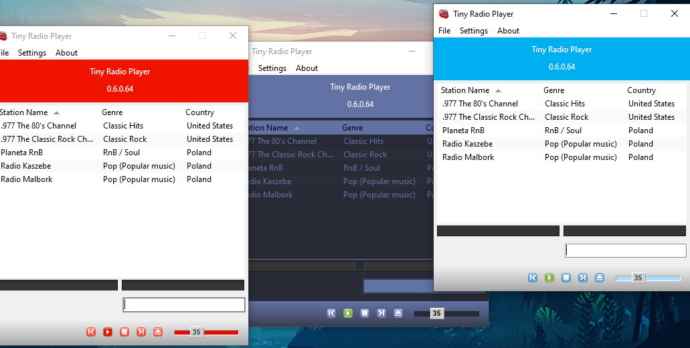
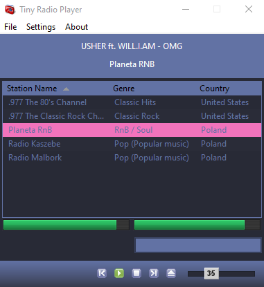
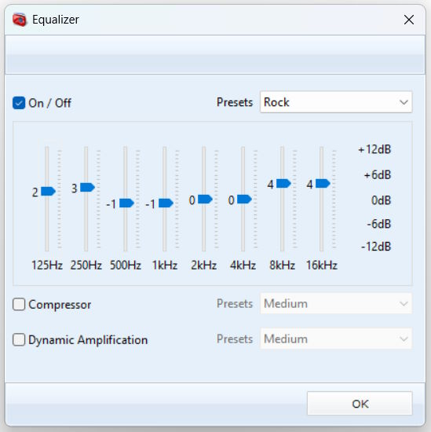

# Tiny Radio Player

A simple application to play radio stations, written in Free Pascal and [Lazarus](https://www.lazarus-ide.org/).

- 2018.08.15 - [#01 – Introduction](https://github.com/kubagdynia/blog/tree/main/posts/20180815)
- 2018.08.22 - [#02 – Component Installation](https://github.com/kubagdynia/blog/tree/main/posts/20180822)
- 2018.09.22 - [#03 - Work-in-progress version of the application interface](https://github.com/kubagdynia/blog/tree/main/posts/20180922)
- 2018.10.13 - [#04 - Building the Engine](https://github.com/kubagdynia/blog/tree/main/posts/20181013)
- 2018.10.24 - [#05 - Save application settings](https://github.com/kubagdynia/blog/tree/main/posts/20181024)
- 2018.11.04 - [#06 - Changing the application language](https://github.com/kubagdynia/blog/tree/main/posts/20181104)
- 2018.11.07 - [#07 - Error Logging](https://github.com/kubagdynia/blog/tree/main/posts/20181107)
- 2018.11.18 - [#08 - Database](https://github.com/kubagdynia/blog/tree/main/posts/20181118)
- 2018.12.28 - [#09 - Managing an SQLite Database](https://github.com/kubagdynia/blog/tree/main/posts/20181228)
- 2019.09.20 - [#10 - Radio Station List, VirtualTreeView Configuration](https://github.com/kubagdynia/blog/tree/main/posts/20190920)
- 2019.10.12 - [#11 - List of Radio Stations, Managing Data in VirtualStringTree](https://github.com/kubagdynia/blog/tree/main/posts/20191012)
- 2020.01.11 - [#12 - Skin Support](https://github.com/kubagdynia/blog/tree/main/posts/20200111)

